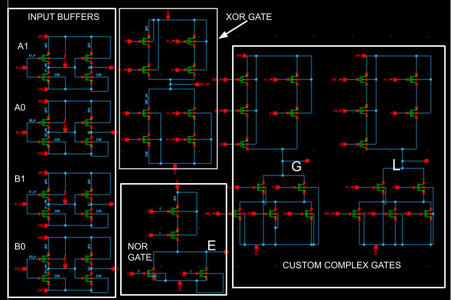

# VLSI Design Final Project: 2-bit Unsigned CMOS Magnitude Comparator | EE103 | Fall 2025 
### Made by: Isaac Medina
### Tufts University
### School of Engineering | Department of Electrical and Computer Engineering
This project uses CMOS transistor topology to implement the digital logic function of a 2-bit unsigned magnitude comparator. Given 2-bit unsigned numbers A and B (Decimal range: [0, 1, 2, 3]), the CMOS transistor network computes whether A is greater than, equal to, or less than B. There are three output signals: G, E, and L.

A comprehensive written report can be found here. 

NOTE: The "SourcePawn" files are actually SPICE files. GitHub recognizes .sp files as SourcePawn files instead.

The buffered circuit netlist is in the "Buffer-Inserted-Timing" directory in the "comparator_timing_v3.sp" file. The non-buffered netlist is in the "Non-Buffered-Timing" directory in the "comparator_timing_v2.sp" file. 

See figures below for circuit diagrams and verification of functionality waveforms.

**Design Summary:**
  - Technology: SAED 32/100nm CMOS
  - Transistor Count: 48
  - Worst-case delays (non-buffered): ~2.1 - 2.5 ns
  - Worst-case delays (buffered): ~1.77 - 1.95 ns
  - Max operation speed: ~500 MHz

## Repository Structure
- **Initial Circuit Analysis Files (No sizing or buffers)**
  - See "Initial-Timing" directory for .sp file and .lis output files

- **Timing Analysis After Logical Effort and Resizing (No buffers)**
  - See "Non-Buffered-Timing" directory for .sp file and .lis output files
 
- **Timing Analysis with Buffer Insertion**
  - See "Buffered-Inserted-Timing" directory for .sp file and .lis output files

- **VHDL**
  - VHDL gate-level script and testbench
  - GTKWave ground truth behavior waveform 

- **Verification of Functionality**
   - verification_of_functionality.sp script
   - Output waveform result from Custom Waveview

- **Schematics**
  - Logic diagrams and schematics from the project
  
## Logic Circuit Diagram

## Synopsys Custom Compiler Schematic

## Ground Truth VHDL Waveform | GTKWave

## Verification of Functionality Waveform | Hspice/Custom Waveview

