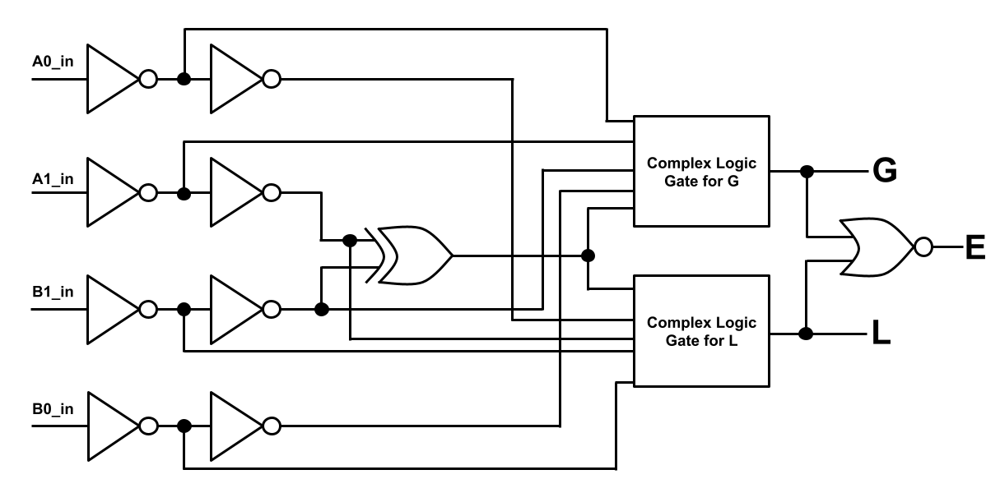
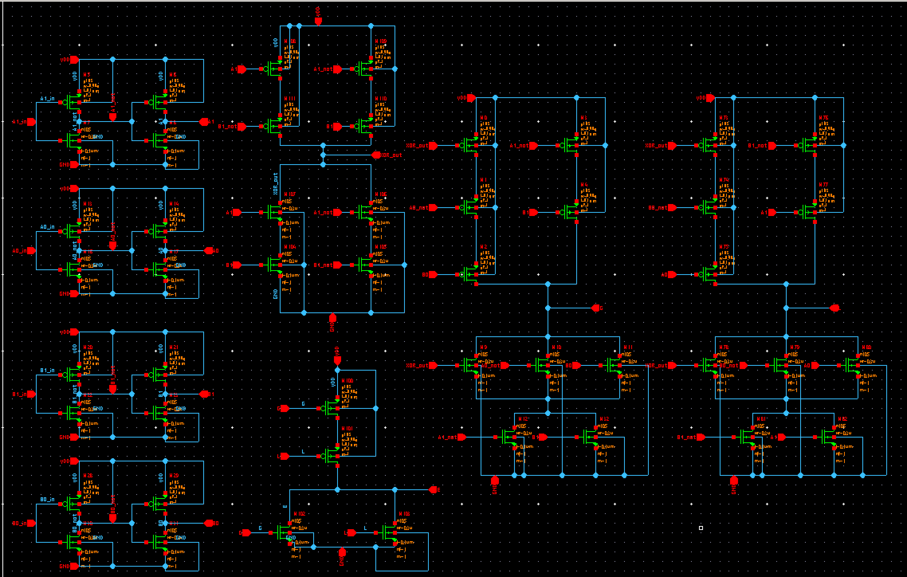
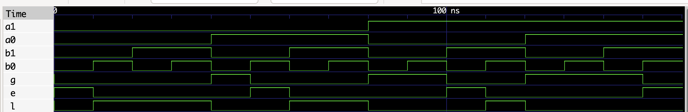

# EE103 | VLSI Design Final Project: 2-bit Unsigned CMOS Magnitude Comparator 
### Made by: Isaac Medina
This project uses CMOS transistor topology to implement the digital logic function of a 2-bit unsigned magnitude comparator. Given 2-bit unsigned numbers A and B (Decimal range: [0, 1, 2, 3]), the CMOS transistor network computes whether A is greater than, equal to, or less than B. There are three output signals: G, E, and L.

A comprehensive written report can be found here. 

NOTE: The "SourcePawn" files are actually SPICE files. GitHub recognizes .sp files as SourcePawn files instead.

The buffered circuit netlist is in the "Final-Timing-Parameters" directory in the "comparator_timing_v3.sp" file. The non-buffered netlist is in the "Timing_with_Scaling" directory in the "comparator_timing_v2.sp" file. 

Worst case delays < 2 ns (see report for more information): ~500 MHz capable.

## Logic Circuit Diagram

## Synopsys Custom Compiler Schematic

## Ground Truth VHDL Waveform | GTKWave

## Verification of Functionality Waveform | Hspice/Custom Waveview

